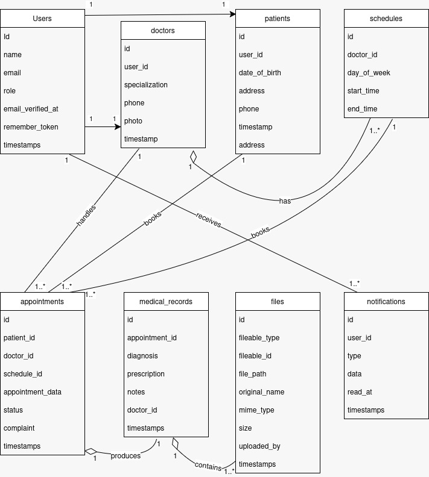

# Hospital Management System API 🏥
> Hospital Management System (HMS) RESTful API built with Laravel. Final Project for BNCC LnT Back-End 2026.

## 👥 Our Team

| Name | Role | Core Responsibilities |
| :--- | :--- | :--- |
| **Alyaa Rana Raya** | Backend Lead & Architect | DB Schema (3NF), Sanctum Auth, Core Logic |
| **Joshua Genio Wiratama** | API & Data Specialist | REST Standards, Seeding/Factory, Pagination |
| **Nathan Grabiel Pramellah** | Storage & Comms Engineer | File Storage, Laravel Scheduler, Mailing |

*Note: Commit messages in this repository use the initials `[ARR]`, `[NGP]`, and `[JGW]` to identify the author's contributions.*

## ✨ Fitur Utama
* **Multi-Role Authentication:** Akses terstruktur menggunakan Laravel Sanctum untuk Admin, Dokter, dan Pasien.
* **Appointment Management:** Sistem booking janji temu yang terintegrasi dengan jadwal dokter.
* **Medical Records:** Pencatatan dan pembacaan riwayat medis (diagnosis & resep) secara aman.
* **Secure File Storage:** Upload dokumen rekam medis dan pasfoto dengan validasi dan otorisasi.
* **Automated Mailing & Task:** Notifikasi email (konfirmasi & *reminder*) menggunakan Laravel Scheduler.

## 🗄️ Entity Relationship Diagram (ERD)


## ⚙️ Instalasi & Setup Environment
Berikut adalah langkah-langkah untuk menjalankan aplikasi secara lokal:

1. Clone repository ini:
   ```bash
   git clone [https://github.com/AlyaaRana/hosipital_management_system_dracch.git]
   cd hosipital_management_system_dracch
2. Install seluruh dependencies (PHP & vendor):
   composer install
3. Setup file environment
   cp .env.example .env
   php artisan key:generate
4. Konfigurasi kredensial Database di file .env, lalu jalankan migrasi beserta dummy data (Seeder):
   php artisan migrate --seed
5. Hubungkan direktori storage untuk akses file:
   php artisan storage:link
6. Jalankan server lokal:
   php artisan serve

## 📌 API Endpoints
Berikut endpoint utama yang tersedia di API:

- `POST /api/v1/auth/register`
- `POST /api/v1/auth/login`
- `POST /api/v1/auth/logout`
- `GET /api/v1/doctors`
- `GET /api/v1/doctors/{id}`
- `GET /api/v1/patients`
- `POST /api/v1/patients`
- `GET /api/v1/patients/{id}`
- `PUT /api/v1/patients/{id}`
- `DELETE /api/v1/patients/{id}`
- `POST /api/v1/appointments`
- `GET /api/v1/appointments/{id}`
- `PUT /api/v1/appointments/{id}`
- `DELETE /api/v1/appointments/{id}`
- `POST /api/v1/medical-records`
- `GET /api/v1/medical-records/{id}`
- `POST /api/v1/files/upload`
- `GET /api/v1/files/{id}`
- `DELETE /api/v1/files/{id}`
- `GET /api/v1/reports/export`

## 🧪 Test Plan & Code Coverage
Proyek ini mengimplementasikan Feature Test dan Unit Test sesuai standar (minimal 10 Test Cases).
Unit Tests (tests/Unit/)
1. ExampleTest - Contoh unit test dasar.

Feature Tests (tests/Feature/)
1. AuthTest - Uji coba Register, Login, dan Logout.
2. AppointmentTest - Membuat appointment (201), Gagal saat jadwal penuh (422), Update, dan Pembatalan.
3. AppointmentMailTest - Verifikasi email konfirmasi dan perubahan status email.
4. ReportExportTest - Uji export laporan PDF/CSV untuk Admin (200) dan ditolak untuk non-Admin (403).
5. DoctorScheduleTest - Validasi jadwal dokter.
6. FileTest - Upload file sukses, baca file, dan Soft delete file.
7. SchedulerCommandTest - Validasi scheduler command untuk appointment reminder dan file purge.
8. ErrorHandlingTest - Validasi error response dan akses terlarang.

Menjalankan Test:
composer test
# atau
php artisan test --coverage


